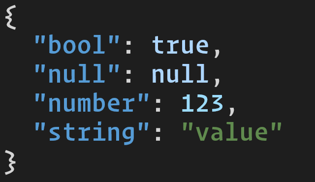

[![Crates.io][ci]][cl] [![Docs.rs][di]][dl]

[ci]: https://img.shields.io/crates/v/termcolor-json.svg
[cl]: https://crates.io/crates/termcolor-json/

[di]: https://docs.rs/termcolor-json/badge.svg
[dl]: https://docs.rs/termcolor-json/

# termcolor-json

A library for writing colored [JSON](https://crates.io/crates/serde_json) output to a [termcolor](https://crates.io/crates/termcolor) terminal.

```rust
let stdout = StandardStream::stdout(ColorChoice::Auto);

termcolor_json::to_writer(
    &mut stdout.lock(),
    &serde_json::json!({
        "string": "value",
        "number": 123,
        "bool": true,
        "null": null,
    }),
)?;
```



## License

Licensed under either of

 * Apache License, Version 2.0
   ([LICENSE-APACHE](LICENSE-APACHE) or http://www.apache.org/licenses/LICENSE-2.0)
 * MIT license
   ([LICENSE-MIT](LICENSE-MIT) or http://opensource.org/licenses/MIT)

at your option.

## Contribution

Unless you explicitly state otherwise, any contribution intentionally submitted
for inclusion in the work by you, as defined in the Apache-2.0 license, shall be
dual licensed as above, without any additional terms or conditions.
